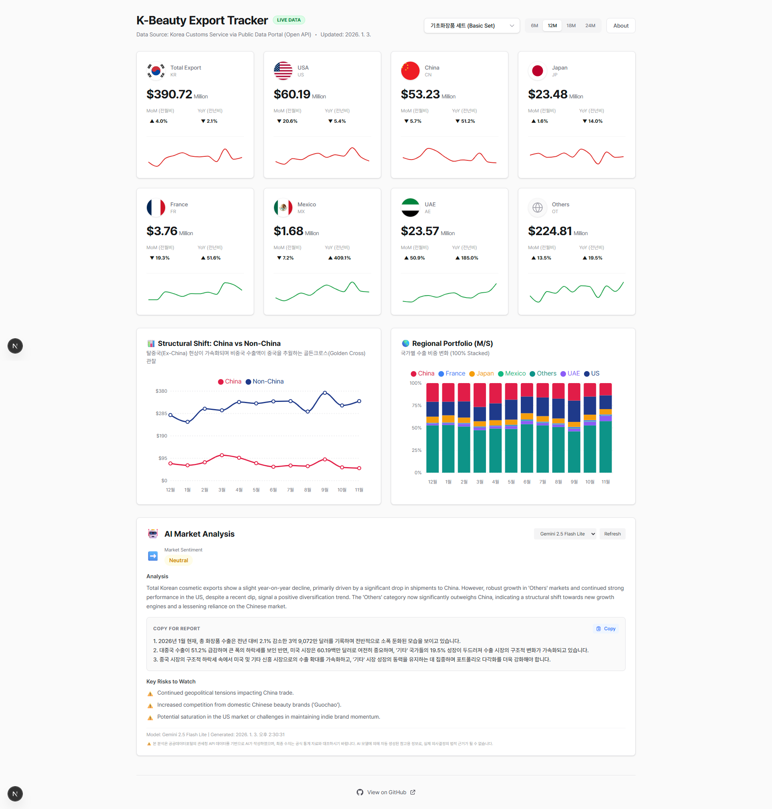

# K-Beauty Export Tracker (Beta)
현직 K-뷰티 수출 전략가 및 애널리스트가 전략 수립에 즉시 활용할 수 있도록, **정밀 품목 수출(HSK) 데이터**와 **AI 기반 분석**을 제공합니다.
<p align="center">
  
</p>

2026년 화장품 산업의 핵심 키워드인 **수출 구조의 질적 성장**과 **글로벌 시장(Non-China Expansion) 다변화**를 실시간 데이터로 추적하는 전문가용 대시보드입니다.

## 기획 의도

- **Trend Tracking**: '탈중국' 흐름과 '북미/일본/유럽' 등으로의 시장 다변화(Golden Cross) 시각화
- **Real-time Insight**: 관세청 실시간 API 연동 및 AI 자동 요약

---

## 핵심 기능 (Professional Features)

### 1. 정밀 품목 분석 (Item Analysis Engine)
HSK 2025 최신 분류 체계를 적용하여 14개 핵심 품목에 대한 개별 데이터를 제공합니다.
- **기초(Basic)**: 기초화장품 세트, 마스크팩(겔/시트 통합), 기능성 화장품
- **색조(Makeup)**: 립스틱, 아이섀도, 파우더, 마스카라 등
- **헤어(Hair) & 바디**: 샴푸, 린스, 바디워시(3401 세정제 특화 매핑)
- **기타**: 향수, 데오도런트

### 2. Context-Aware AI 마켓 분석
Google Gemini Pro 모델이 현재 선택된 품목(Item)과 시장 상황을 인지하여 분석합니다.
- 단순 수치 나열이 아닌, **"왜(Why)"**에 집중한 전략적 인사이트 제공
- 품목별 특이사항(예: 마스크팩 HS 코드 이슈) 자동 반영
- 3단계 구조화된 리포트: Sentiment(심리) / Reasoning(원인) / Risks(리스크)

### 3. Structural Shift Index
**Non-China vs China** 수출 비중을 시각화하여 구조적 변화를 한눈에 파악합니다.

---

## Roadmap (Future Updates)

프로젝트의 전문성을 강화하고 의사결정 지원 시스템(DSS)으로 거듭나기 위한 업데이트 계획입니다.

### 1. 수출 단가(Unit Price) 모니터링
- **수익성 분석**: 단순 수출액(Value) 뿐만 아니라, **중량(Weight) 대비 단가($/kg)**를 자동 계산하여 차트에 반영
- **프리미엄화 추적**: 저가 물량 공세인지, 브랜드 프리미엄화에 따른 질적 성장인지 구분 가능한 지표 제공

### 2. 거시 경제 지표 연동 (FRED API)
- **환율 및 소비 지표 분석**: 달러 환율(KRW/USD), 미국 개인소비지출(PCE) 등 FRED 데이터를 수출 실적과 연동하여 상관관계 분석
- **경기 변동 예측**: 거시 지표 변화에 따른 화장품 소비 심리 영향력 모니터링

### 3. K-Beauty 벨류체인 기업 분석
- **공급망 시각화**: 원료사(Upstream) - 제조사(ODM/OEM) - 브랜드사(Downstream)로 이어지는 벨류체인별 주요 기업 정보 제공
- **실적 연동**: 상장사 분기 실적 공시와 실제 수출 통계 데이터를 비교 분석하는 인사이트 기능

### 4. 뷰티 마켓 리서치 에이전트 (AI Agent)
- **자율형 리서치**: 특정 국가의 최신 뷰티 트렌드, 규제 변화, 경쟁사 동향을 웹 서칭을 통해 자동 리포트화
- **대화형 쿼리**: 자연어 질문을 통해 복잡한 수출 통계에서 유의미한 비즈니스 기회 포착

---

## 기술 스택 (Tech Stack)

### Frontend
- **Framework**: Next.js 16 (App Router)
- **Language**: TypeScript 5
- **Styling**: Tailwind CSS 4
- **Visualization**: Recharts (Customized Tooltips & Interactive Legends)

### Backend & Data
- **API**: Next.js API Routes (Serverless Functions)
- **Data Source**: Korea Customs Service Open API (관세청)
- **Database**: Upstash Redis (AI Analysis Caching - 24h TTL)
- **AI Engine**: Google Gemini 2.5 (Pro/Flash/Flash-Lite)

---

## 시작하기 (Getting Started)

### 1. 설치 및 실행

```bash
# 저장소 클론
git clone <repository-url>
cd trade-dashboard

# 의존성 설치
npm install

# 개발 서버 실행
npm run dev
```

### 2. 환경 변수 설정 (`.env.local`)

```env
# Google Gemini API Key
GEMINI_API_KEY=your_key_here

# Korea Customs Service API Key (공공데이터포털)
KOREA_CUSTOMS_API_KEY=your_key_here

# Upstash Redis (Optional: AI 캐싱용)
UPSTASH_REDIS_REST_URL=your_url
UPSTASH_REDIS_REST_TOKEN=your_token
```

---

## Contact & Support

**Project Lead PM: 박용락 (Yongrak Park)**
[yongrak@beautyinsightlab.com](mailto:yongrak@beautyinsightlab.com)

데이터 분석 제휴 및 비즈니스 관련 문의는 메일로 부탁드립니다.

---

**© 2026 Beauty Insight Lab Inc.**
